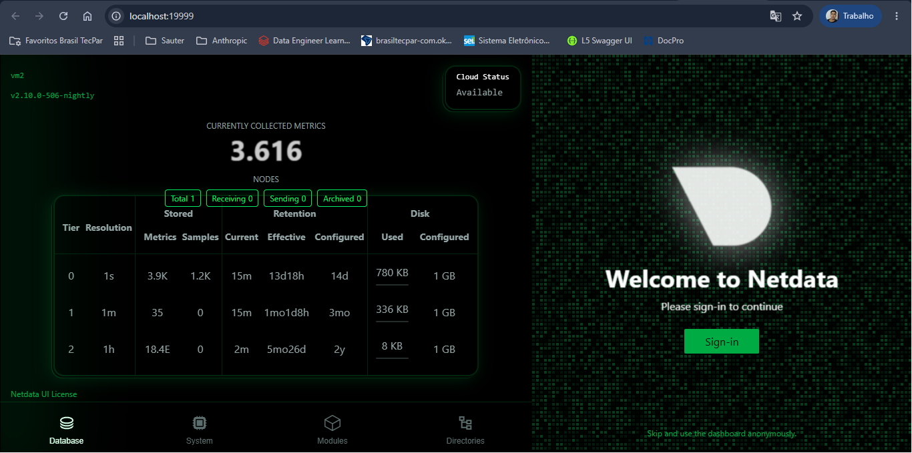

# Infraestrutura GC2 — Monitoramento com Netdata

## Visão geral

Este projeto utiliza duas VMs provisionadas com Vagrant e configuradas via Ansible:

| VM   | IP             | Papel                        |
|------|----------------|------------------------------|
| vm1  | 192.168.22.3   | Gerenciamento (Ansible)      |
| vm2  | 192.168.22.4   | Aplicação (Node.js + Netdata)|

---

## Pré-requisitos

- [Vagrant](https://www.vagrantup.com/)
- [VirtualBox](https://www.virtualbox.org/)
- Ansible instalado na vm1 (provisionado automaticamente)

---

## Como subir o ambiente

```bash
# Vá para a pasta vagrant/

cd vagrant/

# Depois rode
vagrant up
```

---

## Como executar o playbook de monitoramento

Acessa a vm1 e roda o playbook apontando para a vm2:

> [!NOTE]
> Caso sejá necessário, crie uma chave ssh para garantir a conexão
>
> ```bash
> # dentro da vm1 execute
> ssh-keygen -t ed25519
> 
> # Copie a chave para a vm2
> ssh-copy-id vagrant@192.168.22.4
> 
> # Teste a conexão
> ssh vagrant@192.168.22.4
> ```

Rode os playbooks

```bash
vagrant ssh vm1
cd /vagrant

# Instala o node
ansible-playbook -i ansible/inventory.ini ansible/configura-node.yaml

# Instala o NetData
ansible-playbook -i ansible/inventory.ini data/configurar-monitoramento.yml
```

---

## Como visualizar os dados coletados

Após o playbook rodar com sucesso, acessa no navegador do seu PC:

```
http://localhost:19999
```

O dashboard do Netdata abre automaticamente com gráficos em tempo real de:

- CPU, memória e disco da vm2
- Processos em execução
- Tráfego de rede
- Alertas ativos

> A porta 19999 da vm2 está redirecionada para o localhost via `forwarded_port` no Vagrantfile.

---

## Como testar o alerta de CPU

Com o Netdata rodando na vm2, acessa a VM e estresa a CPU:

```bash
vagrant ssh vm2

ssh vagrant@192.168.22.4 # Caso tenha configurado uma ssh para acessar a vm2

stress-ng --cpu 2 --cpu-method matrixprod --timeout 60s
```

O Netdata detecta o uso acima de 80% em até 10 segundos e:
- Exibe o alerta no dashboard em `http://localhost:19999` (aba **Alerts**)

> [!IMPORTANT]
> Para acessar o dashboard do NetData, clique no canto inferior direito, logo abaixo do botão de login, no texto : **Skip and use the dashboard anonymously.**. Caso os dashs estejam parados, clique no botão **LIVE** no canto superior direito.
>



### Níveis de alerta configurados

| Nível    | Condição         |
|----------|-----------------|
| Warning  | CPU > 80%       |
| Critical | CPU > 95%       |

---

## Estrutura do projeto

```
vagrant/
├── Vagrantfile
├── README.md
├── ansible/
│   ├── inventory.ini
│   └── configura-node.yaml
└── data/
    └── configurar-monitoramento.yml
```